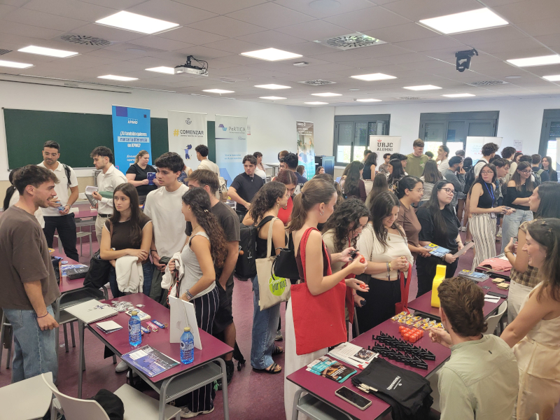
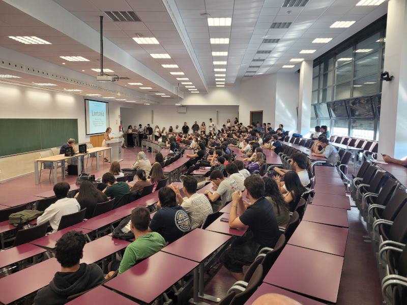
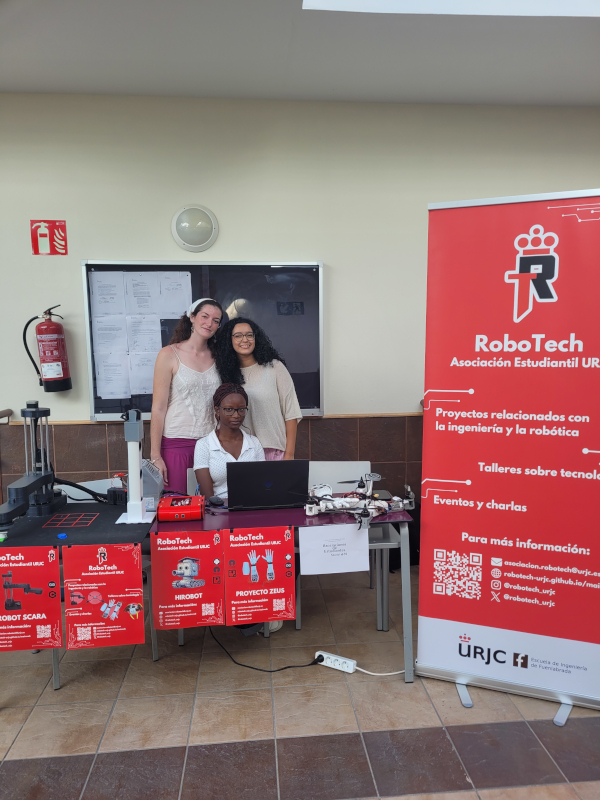
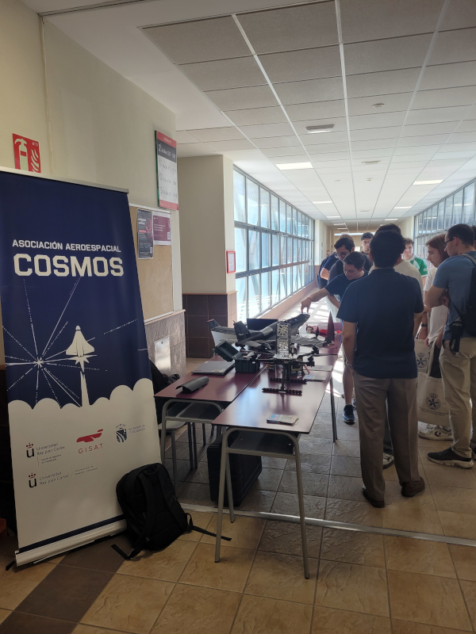

+++
title = "Jornada de Carrera Profesional en la EIF - URJC"
date = 2026-09-24
[taxonomies]
tags = ["urjc"]
+++

El jueves 24 de Septiembre del 2026 se han celebrado la X edición de la **Jornada de Carrera Profesional** en la [EIF](https://www.urjc.es/eif) (Escuela de Ingeniería de Fuenlabrada) de la URJC

Han venido más de 30 empresas y organizaciones a contar al estudiantado lo que hacen, 
y a ofrecer contactos para solicitar prácticas y acceder a ofertas de trabajo

Además los stands, las empresas contaron con **charlas de 20 minutos** para exponer a los
estudiantes qué es lo que hacen

Gran parte del personal de Ingeniería que viene a dar las charlas son antiguos estudiantes de la URJC, lo que es motivo de mucha satisfacción para todos los profesores

Y como todos los años, no pudieron faltar los stands de las asociaciones de estudiantes: **cosmos** y **Robotech**

El organizador de este evento es **Gregorio Robles**
