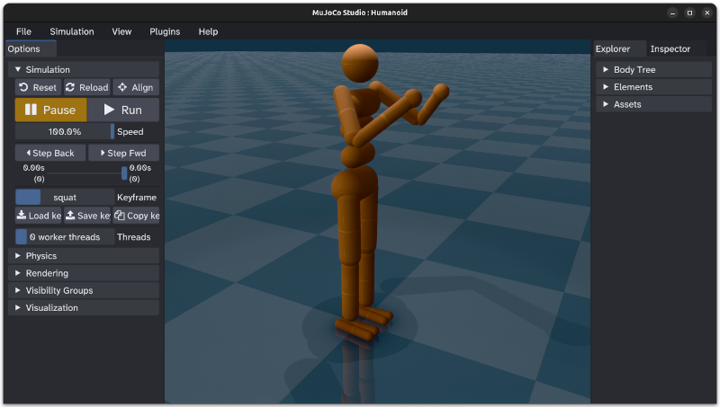
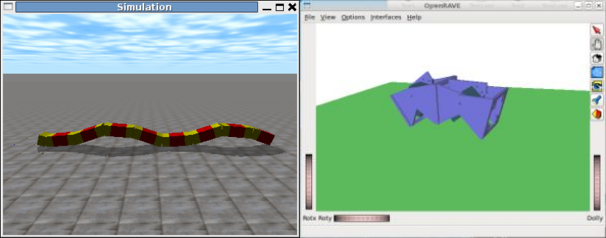
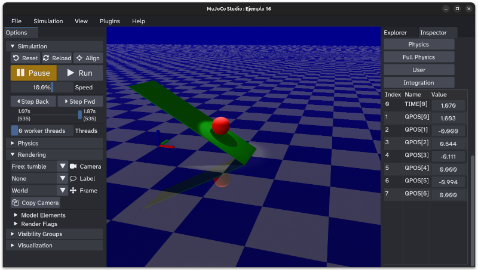

+++
title = "El simulador físico mujoco"
date = 2026-09-25
[taxonomies]
tags = ["software", "mujoco"]
+++

Gracias a [Roberto Calvo](https://github.com/rocapal) me he enterado de la existencia del **simulador físico** [MuJoCo](https://mujoco.org/)

Hace muchos años, durante 
[mi tesis](https://obijuan.github.io/iearobotics-site/wiki/Juan_Gonzalez_Tesis.html) 
y mi estancia en la **Universidad Carlos III de Madrid**, utilicé
simuladores basados en el **ODE** (Open Dynamics Engine) para estudiar la **locomoción de
los robots modulares**

* [Tutorial: ODE y robots modulares](https://obijuan.github.io/iearobotics-site/wiki/Tutorial_ODE_y_robots_modulares.html)  
* [OpenRave y Robots modulares](https://obijuan.github.io/iearobotics-site/wiki/OpenRave_y_robots_modulares.html)

Ahora quiero aprender Mucojo a fondo para utilizarlo en la simulación de los robots modulares. La idea es empezar rehaciendo lo que ya conozco: la simulación de las configuraciones mínimas, y el estudio de su coordinación

He comenzado un **LOG** de aprendizaje en la wiki, donde estoy haciendo experimentos sencillos para aprender los fundamentos

* [LOG-Mujoco](https://github.com/Obijuan/Learn-simulations/wiki/LOG%E2%80%90Mujoco)

Cuando tenga el log más avanzando, y sepa mejor cómo programar con mujoco, quiero migrar [el tutorial de ode y Robots modulares](https://obijuan.github.io/iearobotics-site/wiki/Tutorial_ODE_y_robots_modulares.html) a Mujoco

* **Vídeo en Youtube**:

