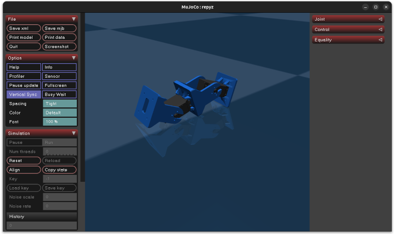

+++
title = "Módulos REPYZ en Mujoco"
date = 2026-09-26
[taxonomies]
tags = ["software", "mujoco", "modular_robots"]
+++

[Roberto Calvo](https://github.com/rocapal) ha modelado los módulos [REPYZ](https://github.com/Obijuan/REPYZ) en [Mujoco](https://mujoco.org/), y ha hecho un programa para mover un único módulo aplicando una señal sinusoidal. El programa permite visualizar la señal aplicada y ver la real del servo

* Proyecto en Github: [repyz-mujoco](https://github.com/rocapal/repyz-mujoco)

Cuando me lo ha enseñado me he emocionado, y no he podido evitar la tentación de construir una **configuración mínima PP**, formada por **2 módulos Repyz**, y simular su **locomoción** en línea recta

¡Se mueve exactamente igual que el robot real! ¡Es impresionante!

* **Vídeo en Youtube**:

Mi idea es **aprender Mucojo** más a fondo y realizar **experimentos de lomoción** utilizando **algoritmos genéticos**, para reproducir los resultados que obtuve en mi tesis, pero usando **herramientas más modernas**

La idea de Roberto es utilizar los servos **Dynamixel** (que tienen realimentación de la posición) y algoritmos de **machine learning** para que la configuración aprenda a moverse

También tengo pensado crear unos nuevos módulos REPYZ para los servos Dynamicxel y poder probar la locomoción aprendida en un robot real, usando una red neuronal. Pero todavía queda mucho para llegar ahí... hay que aprender en el camino

